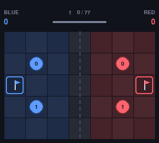

# markov-games

> Small Markov games for studying multi-agent reinforcement learning — self-play,
> coordination, competition, and what happens when your opponent is learning too.

<p align="center">
  
</p>

<p align="center">
  <em>Four random agents, seed 748. At t=60 <code>blue_0</code> grabs the red flag;
  at t=76 it gets home. This happens in 0.6% of random episodes — which is rather
  the point.</em>
</p>

This is a learning repo, in both senses: the agents learn, and so do I. Every
environment and every algorithm here is written from scratch and kept small
enough to read in one sitting, because the object of the exercise is to
understand the mechanics of multi-agent RL rather than to consume them through a
framework.

## Quick start

```bash
git clone git@github.com:ZeroHypotheses/markov-games.git
cd markov-games
uv sync

uv run pytest                        # 58 tests, ~0.2s
uv run mg-rollout --render human     # watch four random agents
```

```python
from markov_games import CaptureTheFlagEnv

env = CaptureTheFlagEnv(render_mode="rgb_array")
observations, infos = env.reset(seed=0)

while env.agents:
    actions = {agent: env.action_space(agent).sample() for agent in env.agents}
    observations, rewards, terminations, truncations, infos = env.step(actions)

print(env.game_state.scores)
```

It is a standard PettingZoo `ParallelEnv`, so anything that speaks that API works
— but nothing in this repo depends on anything that does.

## The game: 2v2 Capture the Flag

Four agents — `blue_0`, `blue_1`, `red_0`, `red_1` — on a small symmetric grid
(7×5 by default, configurable). Cross into enemy territory, take their flag, get
it home. Stand next to an intruder in your own half and you tag them: they
respawn and the flag they were carrying goes straight back to its base.

| | |
|---|---|
| **Actions** | `STAY`, `UP`, `DOWN`, `LEFT`, `RIGHT` — simultaneous |
| **Rewards** | +1 to both agents of a scoring team, −1 to both of the other. Nothing else. |
| **Ends** | first team to 3 captures, or 256 timesteps |
| **Observability** | full, but built separately from the state so it can be narrowed later |
| **Dynamics** | fully deterministic — same seed and actions ⇒ identical trajectory |

The complete rules are specified in
**[`docs/capture-the-flag.md`](docs/capture-the-flag.md)**, which is the source
of truth: every collision case, every tie-break, and the list of things that are
deliberately *not* modelled. The code follows that document section by section.

Two design commitments are worth calling out, because they shape everything else:

**The successor state is computed from the full joint action.** Nothing is
resolved in agent order. Movement conflicts — swaps, contested cells, chains of
agents pushing into each other — are cancelled to a fixpoint, so no agent ever
benefits from being earlier in a list. A rotating cycle of four agents all moves;
a swap moves nobody.

**The rewards are sparse and stay sparse.** No distance-to-flag bonus, no tag
reward, no step penalty. Sparse credit assignment across two co-learning agents
*is* the research question; shaping it away would delete the experiment.

### What random play looks like

The floor, measured rather than guessed — 500 episodes, seeds 0–499:

| | per episode |
|---|---|
| tags | 14.82 |
| flag pickups | 0.52 |
| **captures** | **0.006** (3 captures in 500 episodes) |

Random agents steal the flag reasonably often and almost never get home with it.
That is a genuinely sparse reward signal, and it is the number every learning
baseline has to beat.

## Roadmap

The environment is done; the algorithms come next, in this order:

```
Random  →  Tabular IQL  →  Independent DQN  →  IPPO  →  MAPPO
   ✅            ·                ·              ·         ·
```

IQL is intentionally first, and it is *not* expected to play well. Its job is to
put the classic multi-agent failure modes on screen: non-stationarity from a
co-learner that keeps changing, coordination that never forms, strategies that
oscillate instead of converging. You cannot appreciate what centralised training
buys until you have watched independent learners fail without it.

The questions the ladder exists to answer:

- Where exactly does a tabular representation stop being feasible?
- Can you *see* independent learners destabilising each other in the curves?
- Do attacker and defender roles emerge without being designed in?
- Does centralised training (MAPPO) improve coordination, or only sample efficiency?

## Layout

| Path | What |
|---|---|
| [`docs/capture-the-flag.md`](docs/capture-the-flag.md) | the rule spec — source of truth for the mechanics |
| `src/markov_games/games/capture_the_flag/` | `config` · `state` · `rules` · `observations` · `env` · `render` |
| `src/markov_games/policies.py` | non-learning policies (the random floor) |
| `src/markov_games/rollout.py` | `mg-rollout` — run episodes, record GIFs |
| [`tests/`](tests/) | one test per rule in the spec, plus PettingZoo API conformance |
| [`AGENTS.md`](AGENTS.md) | the agent contract — principles, conventions, hard rules |
| [`workflows/`](workflows/) | harness-neutral playbooks for agents working here |

`rules.py` is a pure function of `(config, state, joint_action)` — no RNG, no
I/O, no environment object. That is what makes the mechanics testable in
isolation and every run reproducible.

## Rendering

```bash
uv run mg-rollout --render human --episodes 3
uv run mg-rollout --seed 748 --max-cycles 77 --cell-size 44 \
    --gif docs/media/capture-the-flag.gif
```

`human` opens a window; `rgb_array` returns frames and never touches the display
subsystem, so it works headless — which is how the GIF above was made, and how
the renderer gets tested.

## Working with agents

This repo is **harness-agnostic by construction**. A coding agent is a full
participant here, and no agent gets instructions another cannot reach.

| Layer | File | Portable? |
|---|---|---|
| The contract | [`AGENTS.md`](AGENTS.md) | ✅ canonical |
| The playbooks | [`workflows/`](workflows/) | ✅ plain markdown, no harness syntax |
| The skills | `.agents/skills/<name>/SKILL.md` | ✅ cross-harness layout |

Everything harness-specific is a **symlink, never a second copy**: `CLAUDE.md`,
`GEMINI.md` and `.github/copilot-instructions.md` all point at `AGENTS.md`, and
`.claude/skills/*` symlinks into `.agents/skills/`. So Claude Code, Codex,
Cursor, Gemini CLI and Copilot follow byte-identical instructions.

The skills are ~18-line wrappers whose entire body is "read `workflows/<x>.md`",
so the substance exists in exactly one place and cannot drift. **Claude Code**
surfaces them as `/mg-game` and `/mg-algorithm`; **everywhere else**, ask in
words — "add a game", "implement IQL" — and the routing table in `AGENTS.md`
points at the same playbook. A slash command is a shortcut, never a prerequisite.

```bash
./scripts/check-harness-agnostic.sh   # verifies all of the above still holds
```

## Development

```bash
uv sync                                  # install, including dev tools
uv run pytest                            # tests
uv run ruff check . && uv run ruff format .
./scripts/check-harness-agnostic.sh      # agent-facing invariants
```

Python 3.11+. Dependencies are deliberately few: NumPy, PyTorch, Gymnasium,
PettingZoo, Pygame.

## License

MIT — see [LICENSE](LICENSE).
